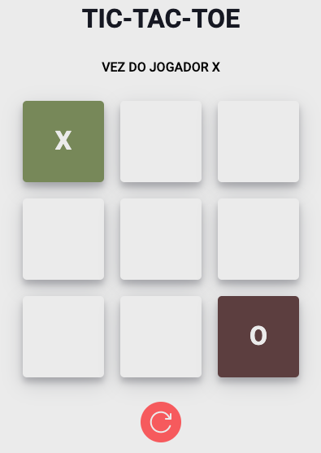

    <h1>Jogo da Velha (multiplayer)</h1>
    

 
### Projeto desenvolvido para treinamento da biblioteca React.js.

A regra é simples: os 2 jogadores precisam fazer uma sequência de três símbolos iguais que podem estar em linha vertical, horizontal ou diagonal.